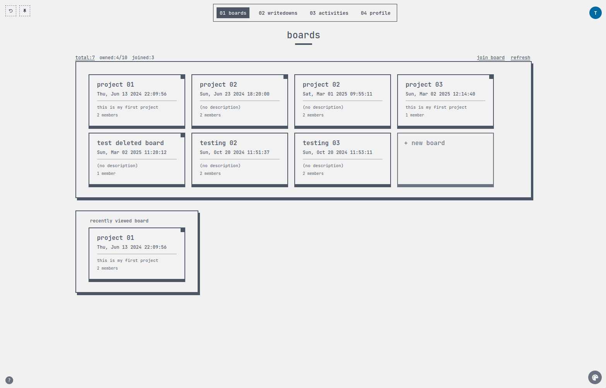
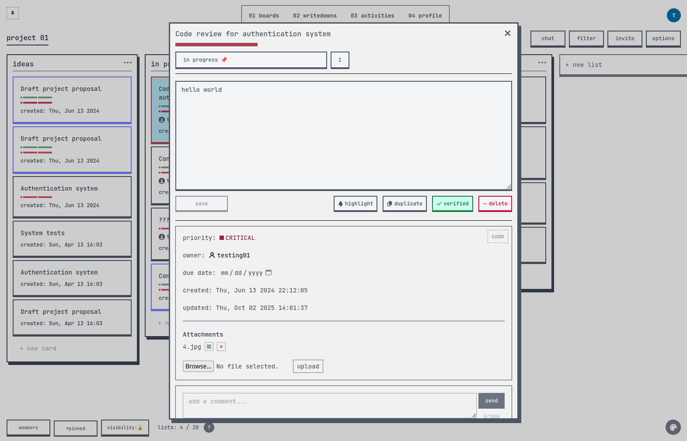
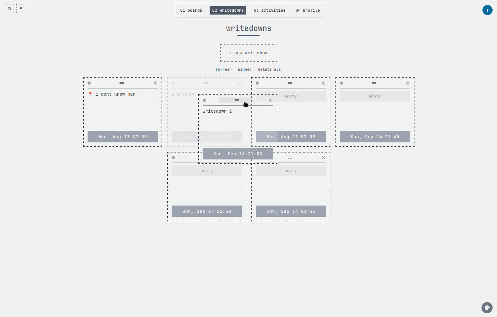
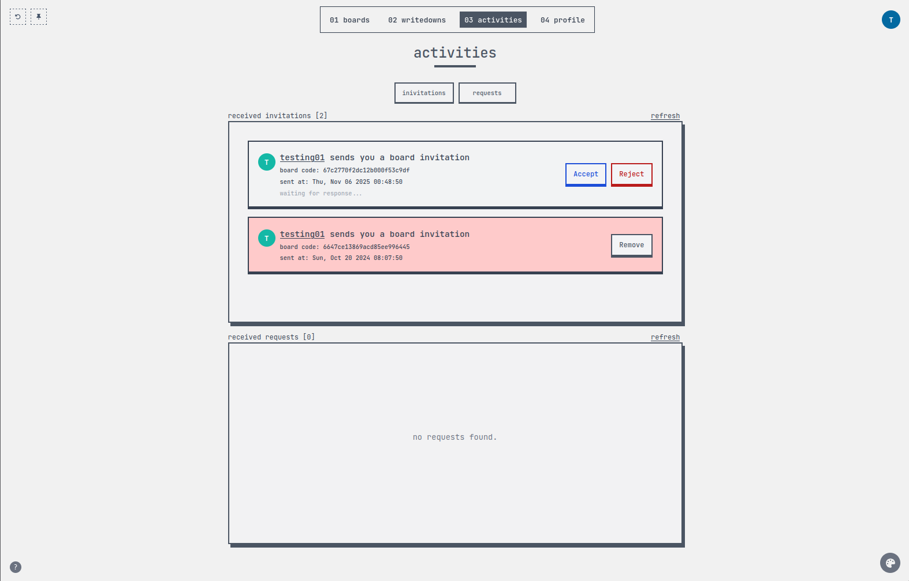
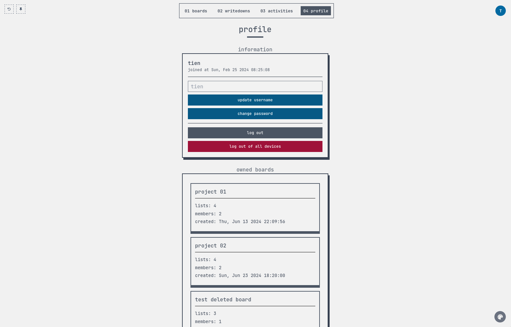

## tamago start

My personal task manager built with the MERN stack and Socket.io. It includes features such as drag-and-drop lists and cards, real-time chat, notes, activity history, and keyboard shortcuts (including vim-like navigation).

This project is inspired by Trello, with some customizations to better fit personal workflow preferences.







### Video Showcase
See the app in action: drag-and-drop, real-time chat, notes, activities, and more.


---

### Live Demo

A demo is available at: [https://task-manager-1-server.onrender.com/](https://task-manager-1-server.onrender.com/)

Note: The application is hosted on a free-tier service, so initial connections (including socket services) may take a few moments to establish.

---

### Quickstart

Requirements: Node.js v21.x or higher

1. Clone this repository.

2. Set up a MongoDB database. See [`server/.env.example`](./server/.env.example) `DB_CONNECTION`

3. Configure environment variables:
   In the `server` folder, create a `.env` file. Refer to [`server/.env.example`](./server/.env.example)

4. Install dependencies and start the services:

    > Run services each folder
    ```bash
    cd server && npm install && npm run dev
    cd client && npm install && npm run dev
    ```

    > Alternatively, use the provided bash scripts to start all services
    ```bash
    bin/dev  # run in development mode
    bin/prod # run in production mode
    ```

5. Open the application in your browser:
   - Visit [http://localhost:5173/](http://localhost:5173/) if run `bin/dev`
   - Visit [http://localhost:3001/](http://localhost:3001/) if run `bin/prod`

---

### Running Tests

```bash
cd server && npm test
```

